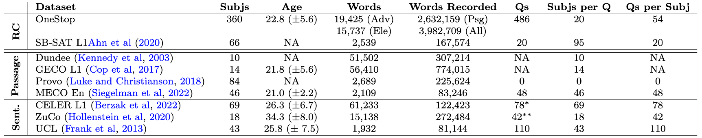

# OneStop: A 360-Participant English Eye-Tracking Dataset with Different Reading Regimes

## Example


## Overview

OneStop Eye Movements is a large-scale corpus of eye movements in reading, in which native (L1) speakers read newswire texts in English and answer reading comprehension questions.
OneStop has eye movement recordings from 360 participants over 2.6 million word tokens. The eye movement data was collected over extensively piloted reading comprehension materials comprising 486 reading comprehension questions and auxiliary text annotations geared towards behavioral analyses of reading comprehension. OneStop includes multiple reading regimes: ordinary reading, information seeking, repeated reading of the same text, and reading simplified text.

## Key Statistics

Statistics of publicly available English L1 datasets for passage reading.


 'RC' (Reading Comprehension) are datasets over piloted reading comprehension materials. The remaining datasets are general purpose broad coverage datasets over passages and individual sentences.
 'Words'  is the number words in the textual corpus. Note that differently from the other datasets where each participant reads the entire corpus, in OneStop each participant reads about a third of the corpus, 4225.15 ($SD = 148.9$) words on average.
 'Words Recorded' is the number of word tokens for which eye-tracking data was collected.
 'NA': data not available.
 Standard deviation in parentheses.
$^{*}$ In 5,283 additional tasks in CELER (78 per participant), participants are required to answer whether a given word appeared in the sentence.
$^{**}$ In 390 additional tasks in ZuCo, participants are asked to determine whether the sentence contains a specific semantic relation.

## Experiment Structure

There are four primary manipulations in the experiment: the reading goal (information seeking vs ordinary reading), the given question, the difficulty level of the text, and whether the text is presented for the first or the second time.  


## Trial Structure

Each participant is presented with a practice article consisting of two trials followed by a 10-article batch with 54 experimental trials. At the beginning of each article, a page with the article’s title is presented. The figure below depicts an example of the pages in a single trial in the Hunting and Gathering regimes. Pages presented only in the Hunting regime are depicted in green.


## Obtaining the Data

Data is not yet available. Download instructions will be updated here.

We provide the possibility to download the entire dataset, or any of four sub-corpora:

1. Ordinary reading (download this data if you are interested in a general purpose eyetrackng dataset)
2. Information seeking
3. Repeated reading
4. Repeated reading during information seeking

> There are several ways to obtain the data

> 1. Download the data directly from the [OSF repository](https://osf.io/2prdq/).
> 2. Use the `download_data_files.py` script to download and extract the data files automatically.
<!-- 3. Use the `pymovements` package to download the data. -->
<!-- 4. TODO Add other ways to obtain the data? -->

> ### Direct Download from OSF

> The data files are stored in an [OSF repository](https://osf.io/2prdq/), and can be downloaded manually from the repository.

> ### Python Script

> If the repository has been cloned, they can be downloaded and extracted automatically using the following script:

> ```python
> python download_data_files.py --extract
> ```

<!-- ### pymovements integration

OneStop is integrated into the [pymovements](https://pymovements.readthedocs.io/en/stable/index.html) package. The package allows to easily download the raw data and further process it. The following code snippet shows how to download the data:

```python
# pip install pymovements
import pymovements as pm

dataset = pm.Dataset('OneStop', path='data/OneStop')

dataset.download()
``` -->

## Repository Structure

The repository is structured as follows:

- `data/`: Metadata files.
- `docs/`: Documentation source files.
- `src/`: Scripts for preprocessing the data and reproducing the analyses.

## Reproducing the Analyses in TODO: Add paper link

### Environment Setup

#### Prerequisites

- [Mamba](https://github.com/conda-forge/miniforge#mambaforge) or Conda

#### Setup

1. **Clone the Repository**

    Start by cloning the repository to your local machine:

    ```bash
    git clone https://github.com/lacclab/OneStop-Eye-Movements.git
    cd OneStop-Eye-Movements
    ```

2. **Create a Virtual Environment**

    Create a new virtual environment using Mamba (or Conda) and install the dependencies:

    ```bash
    mamba env create -f environment.yaml
    ```

3. **Activate the Virtual Environment**

    Activate the virtual environment:

    ```bash
    conda activate onestop
    ```

4. **Download spacy model**

    Download the spacy model:

    ```bash
    python -m spacy download en_core_web_sm
    ```

## Documentation

- [Variables](variables.md) Description of the variables in the dataset.
<!-- - [Eyetracking Variables](data_variables.md) Description of the variables in the fixations and interest area reports, including variables related to word properties and syntactic annotation.
- [Metadata Variables](metadata_variables.md) Description of the variables in the participants metadata. -->
- [Technical Setup](technical_setup.md) Information on the technical setup of the experiment and the experiment builder.
- [Known Issues](known_issues.md) Known issues with the dataset.

## Citation

Paper: TODO

```bash
@article{TODO,
  title={TODO},
  author={TODO},
  journal={TODO},
  year={TODO},
  volume={TODO},
  number={TODO},
  pages={TODO},
  doi={TODO}
}
```

## License

The data and code are licensed under a [Creative Commons Attribution 4.0 International License](http://creativecommons.org/licenses/by/4.0/).


