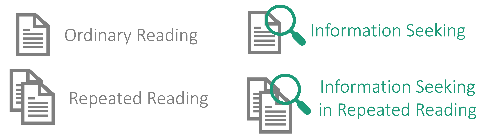

# OneStop: A 360-Participant English Eye-Tracking Dataset with Different Reading Regimes

[📄 Paper (Coming Soon)](https://arxiv.org) | [📚 Documentation](https://lacclab.github.io/OneStop-Eye-Movements/) | [💾 Data (Coming Soon)](https://osf.io/2prdq/) | [🔬 More from LaCC Lab](https://lacclab.github.io/)

## Example


## Overview

OneStop One Movements (in short OneStop) is a large-scale English corpus of eye movements in reading with **360 participants** and over **2.6 million word tokens**, collected using an EyeLink 1000 Plus eyetracker.

The dataset contains four sub-corpora, one for each of the following reading regimes:

* Ordinary reading
* Information seeking
* Repeated reading
* Information seeking in repeated reading



We provide the entire corpus, as well as each of the sub-corpora separately.
If you are looking for a general purpose eye-tracking corpus (like Dundee, GECO, MECO and others), we recommend downloading the ordinary reading sub-corpus.

## Key Features

#### Texts and Reading Comprehension Materials

* Taken from the OneStopQA dataset ([Paper](https://aclanthology.org/2020.acl-main.507/) [Data 🤗](https://huggingface.co/datasets/malmaud/onestop_qa))
* 30 articles with 162 paragraphs in English from the Guardian.
* Each paragraph has two versions: an Advanced version (original Guardian text) and a simplified Elementary version.
* Extensively piloted reading comprehension questions based on the [STARC](https://aclanthology.org/2020.acl-main.507/) (Structured Annotations for Reading Comprehension) annotation framework.
  * 3 multiple-choice reading comprehension questions per paragraph.
  * 486 reading comprehension questions in total.
  * Auxiliary text annotations for answer choices.

#### Statistics

Statistics of OneStop and other public broad-coverage eyetracking datasets for English L1.

| Category | Dataset | Subjects | Age | Words | Words Recorded | Qestions | Subjects per Question | Questions per Subject |
|----------|---------|-------|-----|-------|---------------|-----|-------------|-------------|
| **Reading Comprehension** | OneStop | 360 | 22.8±5.6 | 19,425 (Adv)<br> 15,737 (Ele)<br>19,221 (QA) | 2,632,159 (Parag)<br>1,311,752 (QA) | 486 | 20 | 54 |
| | [SB-SAT L1](https://dl.acm.org/doi/10.1145/3379156.3391335) | 66 | NA | 2,539 | 167,574 | 20 | 95 | 20 |
| **Passages** | Dundee | 10 | NA | 51,502 | 307,214 | NA | 10 | NA |
| | [GECO L1](https://link.springer.com/article/10.3758/s13428-016-0734-0) | 14 | 21.8±5.6 | 56,410 | 774,015 | NA | 14 | NA |
| | [Provo](https://link.springer.com/article/10.3758/s13428-017-0908-4) | 84 | NA | 2,689 | 225,624 | 0 | 0 | 0 |
| | [MECO En](https://link.springer.com/article/10.3758/s13428-021-01772-6) | 46 | 21.0±2.2 | 2,109 | 83,246 | 48 | 46 | 48 |
| **Sentences** | [CELER L1](https://direct.mit.edu/opmi/article/doi/10.1162/opmi_a_00054/110717/CELER-A-365-Participant-Corpus-of-Eye-Movements-in) | 69 | 26.3±6.7 | 61,233 | 122,423 | 78 | 69 | 78 |
| | [ZuCo](https://aclanthology.org/2020.lrec-1.18) | 18 | 34.3±8.0 | 15,138 | 272,484 | 42 | 18 | 42 |
| | [UCL](https://link.springer.com/article/10.3758/s13428-012-0313-y) | 43 | 25.8±7.5 | 1,932 | 81,144 | 110 | 43 | 110 |

<!--  -->
 'Reading Comprehension' are datasets over piloted reading comprehension materials. The remaining datasets are general purpose datasets over passages or individual sentences.
 'Words' is the number words in the textual corpus. 'Words Recorded' is the number of word tokens for which eye-tracking data was collected. 'NA': data not available.

#### Controlled experimental manipulations

1. **Reading goal**: ordinary reading or information seeking.
2. **Prior exposure to the text**: first reading or repeated reading.
3. **Amount of textual material between first and repeated reading**: consecutive or non-consecutive article presentation (2-9 articles).
4. **Paragraph difficulty level**: original Guardian article (Advanced) or a simplified (Elementary).
5. **Question identity**: one of three possible questions for each paragraph.

## Experiment Structure


## Trial Structure

Pages presented only in the information seeking regime are depicted in green.


## Obtaining the Data

Data is not yet available. Download instructions will be updated here.

We provide the possibility to download the entire dataset, or any of four sub-corpora:

1. Ordinary reading (download this data if you are interested in a general purpose eyetracking dataset)
2. Information seeking
3. Repeated reading
4. Information seeking in repeated reading

> There are several ways to obtain the data

> 1. Download the data directly from the [OSF repository](https://osf.io/2prdq/).
> 2. Use the `download_data_files.py` script to download and extract the data files automatically.
<!-- 3. Use the `pymovements` package to download the data. -->
<!-- 4. TODO Add other ways to obtain the data? -->

> ### Direct Download from OSF

> The data files are stored in an [OSF repository](https://osf.io/2prdq/), and can be downloaded manually from the repository.

> ### Python Script

> If the repository has been cloned, they can be downloaded and extracted automatically using the following script:

> ```python
> python download_data_files.py --extract
> ```

<!-- ### pymovements integration

OneStop is integrated into the [pymovements](https://pymovements.readthedocs.io/en/stable/index.html) package. The package allows to easily download the raw data and further process it. The following code snippet shows how to download the data:

```python
# pip install pymovements
import pymovements as pm

dataset = pm.Dataset('OneStop', path='data/OneStop')

dataset.download()
``` -->

## Repository Structure

The repository is structured as follows:

* `data/`: Metadata files.
* `docs/`: Documentation source files.
* `src/`: Scripts for preprocessing the data and reproducing the analyses.

## Reproducing the Analyses in TODO: Add paper link

### Environment Setup

#### Prerequisites

* [Mamba](https://github.com/conda-forge/miniforge#mambaforge) or Conda

#### Setup

1. **Clone the Repository**

    Start by cloning the repository to your local machine:

    ```bash
    git clone https://github.com/lacclab/OneStop-Eye-Movements.git
    cd OneStop-Eye-Movements
    ```

2. **Create a Virtual Environment**

    Create a new virtual environment using Mamba (or Conda) and install the dependencies:

    ```bash
    mamba env create -f environment.yaml
    ```

3. **Activate the Virtual Environment**

    Activate the virtual environment:

    ```bash
    conda activate onestop
    ```

4. **Download spacy model**

    Download the spacy model:

    ```bash
    python -m spacy download en_core_web_sm
    ```

### Running the Analyses

TODO Fill in

## Documentation

### Variables

The dataset contains three types of variables.

* The data variables of the participant Questionnaire file are listed in Table 2 in the OneStop paper.
* The variables included in the Session Summary file are provided in Table 3.
* The eye movement features in the Fixation Reports and Interest Area Reports are documented in the Data Viewer user manual. Additional variables for the experiment, trials and linguistic annotations are listed in Table 4.

### Technical Setup

See Section "Eye-tracking Setup, Text Presentation and Calibration" in the onestop paper.

### Known Issues

See known issues with the dataset [here](known_issues.md).

## Citation

Paper: OneStop: A 360-Participant English Eye-Tracking Dataset with Different Reading Regimes (TODO Add link)

```bash
@article{Berzak2024OneStop,
  title={OneStop: A 360-Participant English Eye-Tracking Dataset with Different Reading Regimes},
  author={TODO},
  journal={TODO},
  year={TODO},
  volume={TODO},
  number={TODO},
  pages={TODO},
  doi={TODO}
}
```

## License

The data and code are licensed under a [Creative Commons Attribution 4.0 International License](http://creativecommons.org/licenses/by/4.0/).


