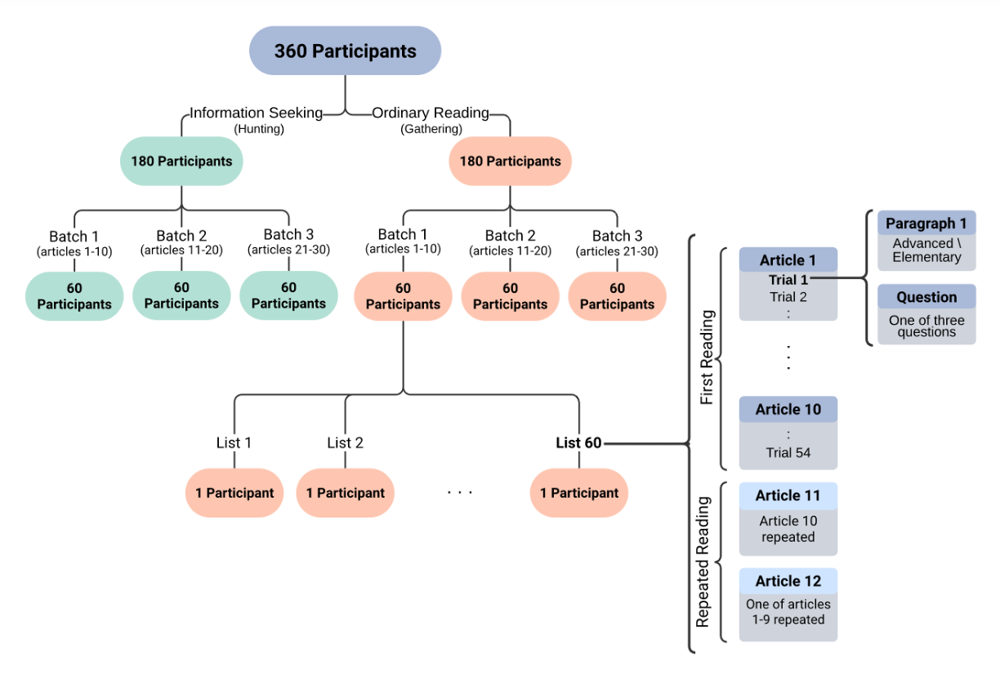

# OneStop: A 360-Participant English Eye Tracking Dataset with Different Reading Regimes

[📄 Paper](https://osf.io/preprints/psyarxiv/kgxv5) | [📚 Documentation](https://lacclab.github.io/OneStop-Eye-Movements/) | [💾 Data](https://osf.io/2prdq/) | [🔬 More from LaCC Lab](https://lacclab.github.io/)

## Example


## Overview

OneStop Eye Movements (in short OneStop) is a large-scale English corpus of eye movements in reading with **360 L1 participants**, **2.6 million word tokens** and **152 hours of recorded eye tracking data**.
The dataset was collected using an EyeLink 1000 Plus eyetracker (SR Research).

The dataset release includes Interest Area Reports (features aggregated at the word level), Fixation Reports (features aggregated at the level of fixations/saccades), raw data in edf format and a detailed participant questionnaire. 
To facilitate analyses, we further provide precomputed text annotations: word length, frequency and surprisal (GPT2), as well as part-of-speech tags and syntactic dependency trees.

OneStop comprises four sub-corpora, one for each of the following reading regimes:

* **Ordinary reading for comprehension** Download this data if you are interested in a general-purpose eye tracking dataset (like Dundee, GECO, MECO and others).
* Information seeking
* Repeated reading
* Information seeking in repeated reading


We provide the entire dataset, as well as each of the sub-corpora separately.

## Key Features

### Texts and Reading Comprehension Materials

* Taken from the OneStopQA dataset ([Paper](https://aclanthology.org/2020.acl-main.507/) [Data 🤗](https://huggingface.co/datasets/malmaud/onestop_qa))
* 30 articles with 162 paragraphs in English from the Guardian.
* Annotations of part-of-speech tags, syntactic dependency trees, word length, word frequency and word surprisal.
* Each paragraph has two versions: an Advanced version (original Guardian text) and a simplified Elementary version.
* Extensively piloted reading comprehension questions based on the [STARC](https://aclanthology.org/2020.acl-main.507/) (Structured Annotations for Reading Comprehension) annotation framework.
  * 3 multiple-choice reading comprehension questions per paragraph.
  * 486 reading comprehension questions in total.
  * Auxiliary text annotations for answer choices.
  
### Statistics

Statistics of OneStop and other public broad-coverage eyetracking datasets for English L1.

| Category | Dataset | Subjects | Age | Words | Words Recorded | Questions | Subjects per Question | Questions per Subject |
|----------|---------|-------|-----|-------|---------------|-----|-------------|-------------|
| **Reading Comprehension** | OneStop | 360 | 22.8±5.6 | 19,425 (Advanced)<br> 15,737 (Elementary)<br>19,221 (QA) | 2,632,159 (Paragraphs)<br>1,311,752 (QA) | 486 | 20 | 54 |
| | [SB-SAT L1](https://dl.acm.org/doi/10.1145/3379156.3391335) | 66 | NA | 2,539 | 167,574 | 20 | 95 | 20 |
| **Passages** | Dundee | 10 | NA | 51,502 | 307,214 | NA | 10 | NA |
| | [GECO L1](https://link.springer.com/article/10.3758/s13428-016-0734-0) | 14 | 21.8±5.6 | 56,410 | 774,015 | NA | 14 | NA |
| | [Provo](https://link.springer.com/article/10.3758/s13428-017-0908-4) | 84 | NA | 2,689 | 225,624 | 0 | 0 | 0 |
| | [MECO En](https://link.springer.com/article/10.3758/s13428-021-01772-6) | 46 | 21.0±2.2 | 2,109 | 83,246 | 48 | 46 | 48 |
| **Sentences** | [CELER L1](https://direct.mit.edu/opmi/article/doi/10.1162/opmi_a_00054/110717/CELER-A-365-Participant-Corpus-of-Movements-in) | 69 | 26.3±6.7 | 61,233 | 122,423 | 78 | 69 | 78 |
| | [ZuCo](https://aclanthology.org/2020.lrec-1.18) | 18 | 34.3±8.0 | 15,138 | 272,484 | 42 | 18 | 42 |
| | [UCL](https://link.springer.com/article/10.3758/s13428-012-0313-y) | 43 | 25.8±7.5 | 1,932 | 81,144 | 110 | 43 | 110 |

<!--  -->
 'Reading Comprehension' are datasets with a substantial reading comprehension component over piloted reading comprehension materials. The remaining datasets are general purpose datasets over passages or individual sentences.
 'Words' is the number of words in the textual corpus. 'Words Recorded' is the number of word tokens for which tracking data was collected. 'NA': data not available.

### Controlled experimental manipulations

1. **Reading goal**: ordinary reading for comprehension or information seeking.
2. **Paragraph difficulty level**: original Guardian article (Advanced) or simplified (Elementary).
3. **Question identity**: one of three possible questions for each paragraph.
4. **Prior exposure to the text**: first reading or repeated reading.

## Experiment Structure



Each participant reads 10 Guardian articles paragraph by paragraph, and answers a reading comprehension question after each paragraph. After reading a 10-article batch, participants read two of the previously presented articles for a second time. Half of the participants are in an information seeking regime where they are presented with the question prior to reading the paragraph.

## Trial Structure

A single experimental trial consists of reading a paragraph and answering one reading comprehension question about it. Trials have the following Interest Periods, corresponding to pages in the experiment:

1. **Question Preview** (only in the information seeking regime) - the participant reads the question (self-paced).
2. **Paragraph** - the participant reads the paragraph (self-paced).
3. **Question** - the participant reads the question again (self-paced).
4. **QA** - retains the question, and also displays the four possible answers in a cross arrangement. Participants are then required to choose one of the answers and confirm their choice (self-paced).
5. **Feedback** - informs the participants on whether they answered the question correctly (presented for one second).

Pages presented only in the information seeking regime are depicted in green.


Overall, the dataset includes 19,438 regular trials, 9,720 in the information seeking regime and 9,718 in the ordinary reading regime. The dataset also includes 3,888 repeated reading trials, split equally between the two reading regimes.

## Obtaining the Data

<!-- There are several ways to obtain the data: -->

### Direct Download from OSF

The data is hosted on [OSF](https://osf.io/2prdq/). We provide the possibility to download four sub-corpora with eye movement recordings from paragraph reading, one for each of the following reading regimes:

1. [OneStop Ordinary Reading](https://osf.io/zn9sq/) - download this data if you are interested in a general-purpose eye tracking dataset.
2. [OneStop Information Seeking](https://osf.io/kpbgx/)
3. [OneStop Repeated Reading](https://osf.io/4ay3t/)
4. [OneStop Information Seeking in Repeated Reading](https://osf.io/6ra7t/)

and two versions of the full dataset:

1. [OneStop](https://osf.io/azj2g/) - paragraph reading for the entire dataset.
2. [OneStop - Full](https://osf.io/z7pyn/) - complete trials for the entire dataset, divided into title, question preview, paragraph, question, answers, QA (question + answers) and feedback.

In addition, we release [metadata files](https://osf.io/jbd24/) which include the participant questionnaire and experiment summary statistics.

### Python Script

The data can also be downloaded using the provided Python script. The script will download and extract the data files.

Basic usage to download the entire dataset:

0. Make sure you have Python installed.
    * If you don't have Python installed, you can download it from [here](https://www.python.org/downloads/).

1. **Get the Code**
   * Open your terminal/command prompt:
     * Windows: Press `Win + R`, type `cmd` and press Enter
     * Mac: Press `Cmd + Space`, type `terminal` and press Enter
   * Run this command to download the code:

     ```bash
     git clone https://github.com/lacclab/OneStop-Eye-Movements.git
     ```

   * Move into the downloaded folder:

     ```bash
     cd OneStop-Movements
     ```

2. **Run the Download Script**
   * Run this command to download the full dataset:

     ```bash
     python onestop/download_data_files.py
     ```

   * The data will be downloaded to a folder called "OneStop"

   * Available options:

      * `--extract`: Extract downloaded zip files (default: True)
      * `--asc`: Download ASC files (default: False)
      * `--edf`: Download EDF files (default: False)
      * `-o, --output-folder`: Specify output folder (default: "OneStop")
      * `--mode`: Choose dataset subcorpora to download (default: "full")
        * Options: "full", "all-regimes", "ordinary",   "information-seeking", "repeated","information-seeking-in-repeated"

3. **Download Specific Parts** (Optional)  

Example usage to download only the ordinary reading subset:

```python

python onestop/download_data_files.py --mode ordinary
```

### pymovements integration

OneStop is integrated into the [pymovements](https://pymovements.readthedocs.io/en/stable/index.html) package. 
The package enables easy download of the paragraph data for the complete dataset. The following code snippet shows how to download the data:

First, install the package in the terminal:

```bash
pip install pymovements
```

Then, use the following python code to download the data:

```python
import pymovements as pm
dataset = pm.Dataset('OneStop', path='data/OneStop')

dataset.download()
```

This will download the data to the `data/OneStop` folder. You can also specify a different path by changing the `path` argument.

## Documentation

* **[Data Files and Variables](https://lacclab.github.io/OneStop-Eye-Movements/variables)**: Detailed information about the data files and variables in the reports.

* **[Known Issues](https://lacclab.github.io/OneStop-Eye-Movements/known_issues)**: Known issues with the dataset. If you identify an issue not listed here, please open a github issue specifying the problem.

* **[Scripts](https://lacclab.github.io/OneStop-Eye-Movements/preprocessing_analyses)**: Scripts for data preprocessing and reproducing the analysis in the dataset paper (see below).

## Citation

Paper: [OneStop: A 360-Participant English Eye Tracking Dataset with Different Reading Regimes](https://osf.io/kgxv5)

```bash
@article{berzak2025onestop,
  title={OneStop: A 360-Participant English Eye Tracking Dataset with Different Reading Regimes},
  author={Berzak, Yevgeni and Malmaud, Jonathan and Shubi, Omer and Meiri, Yoav and Lion, Ella and Levy, Roger},
  journal={PsyArXiv preprint},
  year={2025}
}
```

## License

The data and code are licensed under a [Creative Commons Attribution 4.0 International License](http://creativecommons.org/licenses/by/4.0/).


